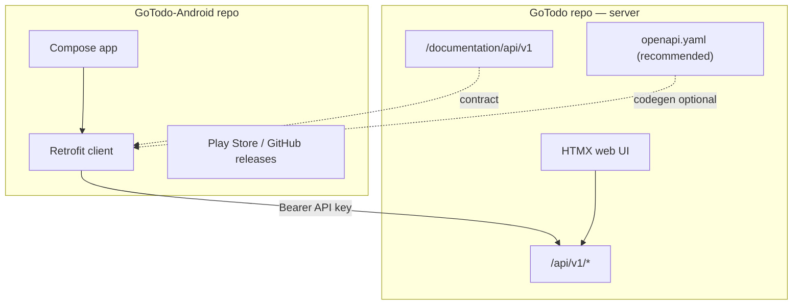

# GoTodo Android — Separate Project Plan

**Status:** Planning  
**Server baseline:** `dev` branch (REST API v1 already implemented)  
**Android codebase:** **Separate repository** (not a subfolder of GoTodo)

---

## Decision: Separate Repo

The Android client should live in its **own project** (e.g. `GoTodo-Android`), not under `android/` in this repo.

### Why separate fits GoTodo

| Factor | Separate repo | Monorepo `android/` |
|--------|---------------|---------------------|
| **Release cadence** | App ships on Play Store independently of server patches | Tied to server repo tags/CI |
| **Toolchain** | Gradle, Android SDK, Kotlin — unrelated to Go/npm | Two build systems in one CI matrix |
| **Contributors** | Mobile devs clone one project | Full server checkout required |
| **Self-hosted model** | App is a generic client for *any* GoTodo instance | Same, but repo coupling implies tighter release lockstep |
| **Scope clarity** | Server repo = API + web; Android repo = client only | Blurs ownership |

GoTodo is a **server product with an API contract**. The mobile app is a **consumer** of that contract — same relationship as the HTMX web UI, but with its own deployment artifact.

### The tradeoff you called out

> If we make drastic site changes for new features, we'd have to update the application.

**True, but only when those features matter on mobile and touch the API.**

| Change type | Android update needed? |
|-------------|------------------------|
| HTMX template / CSS / web-only UX | **No** |
| New web page (admin, import wizard) | **No** (unless mobile wants parity) |
| New field on existing API resource | **Maybe** — additive, old app still works |
| New endpoint for a mobile feature | **Yes** — when you want to expose it |
| Breaking JSON shape or auth | **Yes** — requires app + API version bump |

Most "drastic site changes" on GoTodo are web-layer. The Android app only moves when **API v1** changes or when you **choose** to surface a new capability (dashboard, calendar, saved views, etc.).

---

## Division of Responsibility



### This repo (GoTodo server)

- REST API v1, API keys, rate limits, Redis gate
- Public API documentation (`/documentation/api/v1`)
- **Recommended:** checked-in `openapi.yaml` (or generated) as the machine-readable contract
- **Recommended:** small API gaps for mobile onboarding (`GET /api/v1/health`, `GET /api/v1/me`)
- API changelog notes in release notes when shapes change
- No Android source code

### New repo (GoTodo-Android)

- Kotlin + Jetpack Compose application
- Onboarding: server URL + API key (matches current auth model on `dev`)
- Task list, filters, quick add, detail, settings
- Own README, license, CI, signing, Play Store listing
- Pins **minimum supported server version** in README (e.g. "Requires GoTodo ≥ 0.18 with API enabled")

---

## Keeping the App in Sync (without monorepo pain)

### 1. Treat API v1 as the contract

The web UI and Android app are **parallel clients**. New mobile features should start with an API addition in the server repo, then an app release — not the other way around.

**Rule:** If it's not in `/api/v1`, the Android app doesn't pretend to have it (or uses web fallback link).

### 2. Version the API, not the app bundle

- Breaking changes → `/api/v2` (future), not silent edits to v1
- Additive changes (new optional JSON fields) → same v1, old apps ignore them
- Document deprecations in server release notes

### 3. OpenAPI as shared truth (recommended server addition)

Add `openapi.yaml` to **this repo**, generated or hand-maintained to match `/documentation/api/v1`.

Android repo can:

- Hand-write Retrofit interfaces (fine for small surface)
- Or generate from OpenAPI when the API grows

Either way, **one spec in the server repo** reduces drift arguments.

### 4. Contract / snapshot tests (lightweight)

Server: JSON fixture tests for `GET /api/v1/tasks` response shape.  
Android: MockWebServer tests against the same fixtures (copy or submodule the fixtures file).

When a server PR changes the shape, CI fails until Android updates — optional cross-repo check via scheduled job or manual release checklist.

### 5. Feature flags & graceful degradation

App checks `GET /api/v1/health` (proposed) for `version` and `api_enabled`:

- Unknown/new server → show full feature set available in current app build
- Missing endpoint (404) → hide tab, show "Update app" or "Use web for this feature"
- Old server below minimum → block with upgrade message

### 6. Release checklist (practical)

When shipping a **server** release with API changes:

- [ ] Update `/documentation/api/v1` and `openapi.yaml`
- [ ] Note breaking vs additive in release notes
- [ ] Bump minimum app version if breaking

When shipping an **Android** release:

- [ ] Test against latest `dev` and last stable server tag
- [ ] Document required server version in release notes

---

## What Already Exists on Server (`dev`)

No need to rebuild — Android targets existing endpoints:

| Endpoint | Purpose |
|----------|---------|
| `GET/POST/PATCH/DELETE /api/v1/tasks` | Core task workflows |
| `GET /api/v1/projects` | Project picker |
| `GET /api/v1/tags` | Tag display / assign via `tag_ids` |
| Profile API keys | User creates key on web, pastes in app |

Auth: `Authorization: Bearer <api_key>` (see profile → REST API).

**Small server additions still recommended** (stay in GoTodo repo):

| Endpoint | Purpose |
|----------|---------|
| `GET /api/v1/health` | Server URL validation, `api_enabled`, version |
| `GET /api/v1/me` | Profile screen |
| `GET /api/v1/dashboard` | Dashboard tab (optional P2) |

---

## Android Repo Bootstrap (when created)

Suggested name: **`GoTodo-Android`** (or `gotodo-android`)

```
GoTodo-Android/
├── app/
├── core/
│   ├── network/      # Retrofit, models matching api/v1 JSON
│   └── datastore/    # Server URL + encrypted API key
├── feature/
│   ├── onboarding/
│   ├── tasks/
│   ├── dashboard/
│   └── settings/
├── docs/
│   └── API.md        # Link to server /documentation/api/v1 + min version
├── README.md
└── LICENSE           # Same as server unless you choose otherwise
```

**Not in server repo:** Gradle files, `AndroidManifest.xml`, Play Store assets, signing keys.

---

## Phased Roadmap (cross-repo)

| Phase | Repo | Work |
|-------|------|------|
| **P0a** | Server | `GET /api/v1/health`, `GET /api/v1/me`, optional `openapi.yaml` |
| **P0b** | Android | New repo, onboarding, API key storage |
| **P1** | Android | Task list, filters, quick add, swipe actions |
| **P1** | Server | Only if gaps found during P1 (e.g. `?favorite=true`) |
| **P2** | Server | `GET /api/v1/dashboard`, project write endpoints |
| **P2** | Android | Dashboard tab, project management |
| **P3** | Android | Offline cache, widget |
| **P4** | Both | Push notifications (server job + FCM in app) |

---

## Open Decisions

| # | Question | Recommendation |
|---|----------|----------------|
| 1 | Repo name / org | `xNifty/GoTodo-Android` under same org |
| 2 | OpenAPI in server repo | **Yes** — best anti-drift tool |
| 3 | Mobile login endpoint | **Defer** — paste API key for v1 |
| 4 | Submodule/fixtures sharing | Optional; start with copied JSON fixtures |
| 5 | Link from server README | One line pointing to Android repo when it exists |

---

## Summary

A **separate Android repository** is the better default for GoTodo: cleaner tooling, independent releases, and a clear boundary at **API v1**. Site-only changes won't churn the app; API additions and breaking changes are explicit, versioned events both sides can plan for. Keep the contract (docs + OpenAPI) in the server repo; keep the client in its own project.
